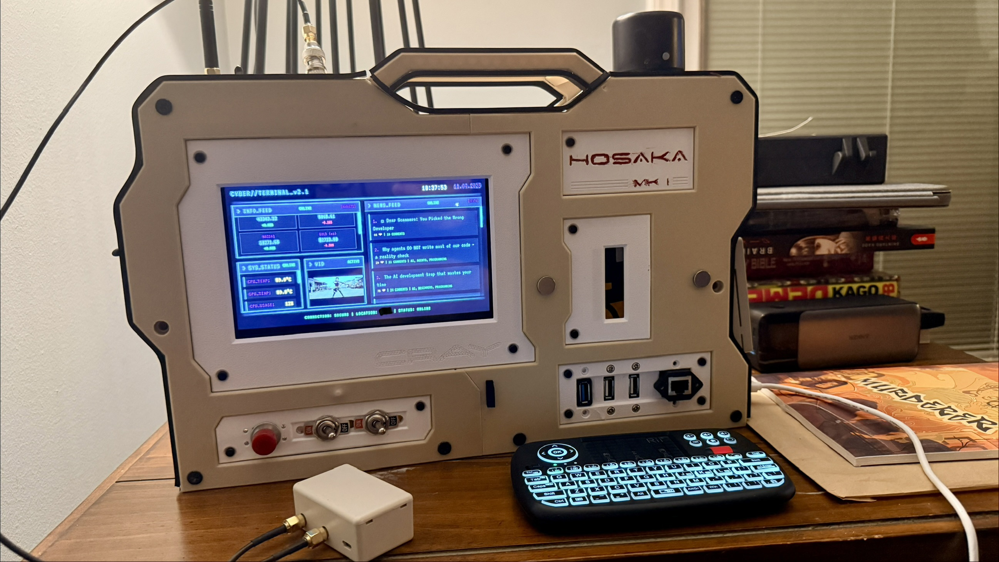
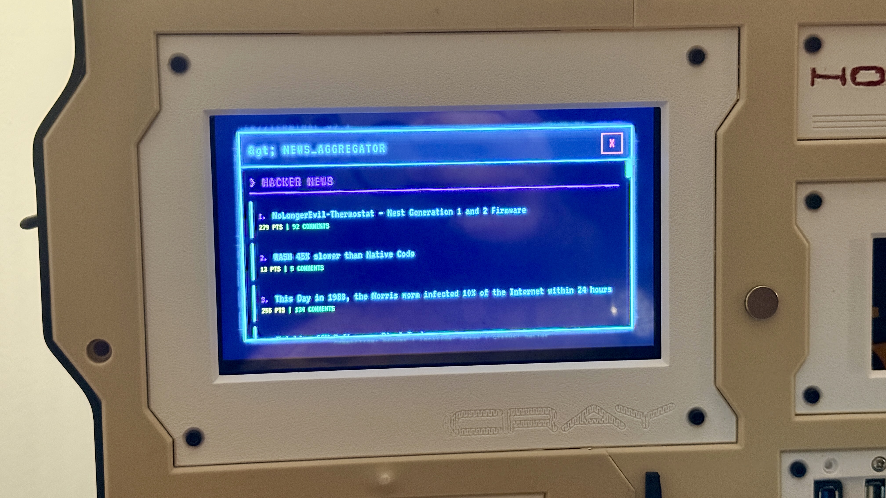
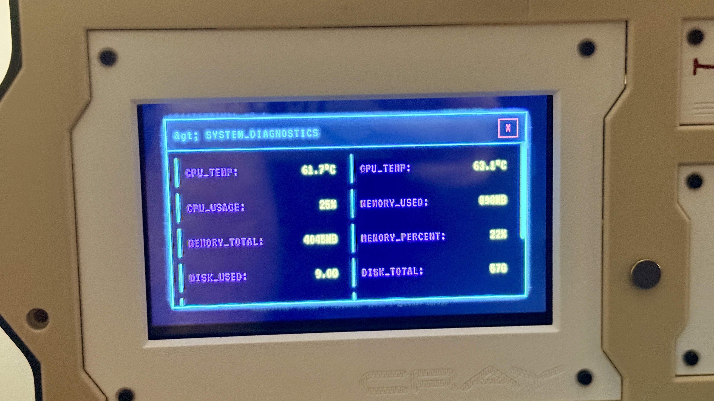
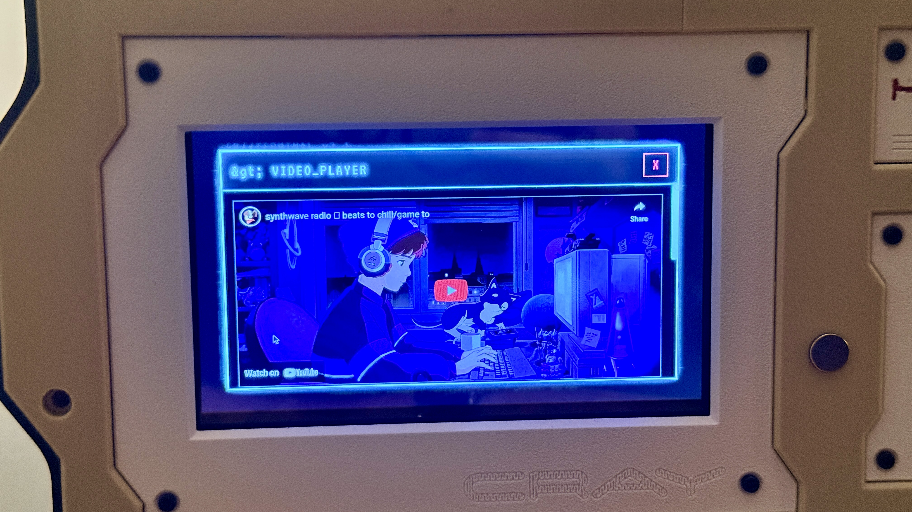
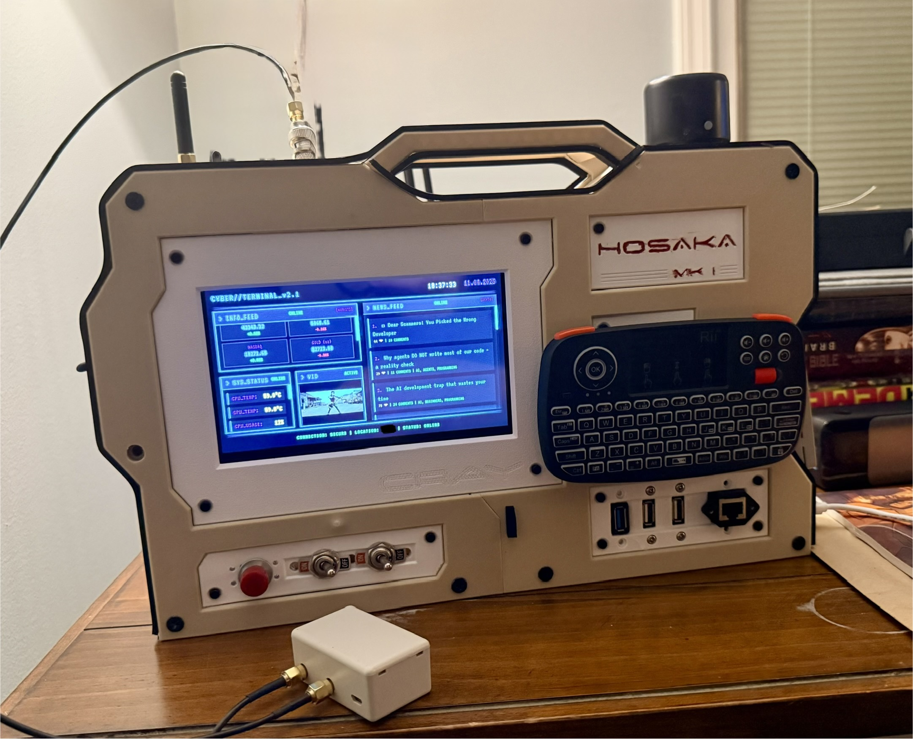

# Cyber Kiosk

A Neuromancer-inspired cyberpunk dashboard for Raspberry Pi with touchscreen. Features real-time weather, system stats, financial data, news feeds, and YouTube integration with retro-futuristic CRT aesthetics.


## Features

- **Retro CRT Display** - Scanlines, phosphor glow, and authentic terminal aesthetics
- **Weather & Financial Data** - Cycles between current weather/forecast and live market data (DOW, S&P 500, NASDAQ, Gold, USD/EUR)
- **YouTube Integration** - Rotating cyberpunk-themed video thumbnails with full player and search modal
- **Multi-Source News** - Rotates through Hacker News, NY Times Tech, and Dev.to every 5 minutes
- **System Monitor** - Real-time Raspberry Pi stats (CPU/GPU temp, memory, disk, load avg, uptime)
- **Interactive Modals** - Click any widget for expanded detailed view
- **Cyberpunk Aesthetic** - Neon cyan/magenta/amber color scheme with glowing text
- **Burn-in Prevention** - Auto-dimming and subtle pixel shifting for 24/7 operation
- **Hidden Exit** - Click bottom-right corner to exit kiosk mode

## Screenshots

### Full Dashboard


*Cyber Kiosk running on HOSAKA MK I cyberdeck with 7-inch display*

### Interactive Modals

<table>
  <tr>
    <td></td>
    <td></td>
    <td></td>
  </tr>
  <tr>
    <td align="center"><b>News Aggregator</b></td>
    <td align="center"><b>System Diagnostics</b></td>
    <td align="center"><b>Video Player</b></td>
  </tr>
</table>

### Hardware Setup


*Complete cyberdeck setup with backlit keyboard and meshtastic antenna*

## Quick Start

### Prerequisites

- Raspberry Pi (3, 4, or 5 recommended)
- Raspberry Pi OS (Debian-based)
- 7-inch touchscreen (or any display)
- Node.js 18+ and npm

### Installation

1. **Clone the repository:**
   ```bash
   git clone https://github.com/YOUR_USERNAME/cyber-kiosk.git
   cd cyber-kiosk
   ```

2. **Run the setup script:**
   ```bash
   ./setup.sh
   ```

   This will:
   - Check dependencies
   - Install npm packages
   - Create your config.json
   - Prompt for API keys (optional)
   - Test the system monitor

3. **Configure your API keys:**

   Edit `config.json` with your API keys (all free):

   ```json
   {
     "zipCode": "90210",
     "weatherApiKey": "YOUR_KEY_HERE",
     "nytApiKey": "YOUR_KEY_HERE",
     "youtubeApiKey": "YOUR_KEY_HERE"
   }
   ```

   Get your free API keys:
   - **Weather:** https://openweathermap.org/api
   - **News:** https://developer.nytimes.com/
   - **YouTube:** https://console.cloud.google.com/apis/credentials (Enable YouTube Data API v3)
   - **Financial (optional):** https://www.alphavantage.co/support/#api-key

4. **Start the system monitor:**
   ```bash
   npm start
   ```

5. **Launch the dashboard:**
   ```bash
   ./launch-kiosk.sh
   ```

   Or open `index.html` directly in Chromium for testing.

## Configuration

All settings are in `config.json`:

```json
{
  "zipCode": "90210",
  "weatherApiKey": "YOUR_KEY",
  "nytApiKey": "YOUR_KEY",
  "youtubeApiKey": "YOUR_KEY",
  "imageChangeInterval": 30000,
  "weatherCycleInterval": 300000,
  "newsUpdateInterval": 300000,
  "systemMonitorUrl": "http://localhost:3001/stats",
  "systemUpdateInterval": 30000
}
```

### Customize YouTube Videos

Edit `js/app.js` and modify the `YOUTUBE_VIDEOS` array:

```javascript
const YOUTUBE_VIDEOS = [
    { id: 'VIDEO_ID', title: 'Video Title' },
    // Add more...
];
```

### Auto-Start on Boot

See [docs/AUTOSTART_SETUP.md](docs/AUTOSTART_SETUP.md) for instructions on:
- Setting up systemd service for the system monitor
- Configuring LXDE/labwc autostart for the dashboard
- Troubleshooting auto-start issues

## Project Structure

```
cyber-kiosk/
├── index.html                 # Main dashboard
├── css/
│   └── style.css             # Cyberpunk styling
├── js/
│   └── app.js                # Application logic
├── system-monitor.js         # Node.js backend (port 3001)
├── config.json               # Your config (gitignored)
├── config.example.json       # Config template
├── launch-kiosk.sh           # Kiosk launcher script
├── setup.sh                  # Interactive setup
├── package.json              # Node dependencies
├── docs/                     # Additional documentation
│   ├── INSTALLATION.md
│   ├── CONFIGURATION.md
│   ├── TROUBLESHOOTING.md
│   └── BURN_IN_PREVENTION.md
└── README.md                 # This file
```

## System Monitor Backend

The system monitor runs as a Node.js server on port 3001 and provides:

- `/stats` - CPU/GPU temp, memory, disk, load average, uptime
- `/financial` - Market data (requires Alpha Vantage API key)
- `/health` - Health check

### Running as a Service

To run the system monitor automatically on boot:

```bash
# Create systemd service (see docs/AUTOSTART_SETUP.md)
sudo systemctl enable cyber-kiosk-monitor
sudo systemctl start cyber-kiosk-monitor
```

## Customization

### Theming

The color scheme is defined in `css/style.css`:

```css
:root {
    --neon-cyan: #00ffff;
    --neon-magenta: #ff00ff;
    --neon-green: #00ff00;
    --neon-amber: #ffbf00;
    --neon-purple: #8a2be2;
}
```

### Intervals

Adjust update frequencies in `config.json` (values in milliseconds).

## Troubleshooting

### Dashboard shows "API_KEY_REQUIRED"
- Copy `config.example.json` to `config.json`
- Add your API keys to `config.json`

### System stats showing ERROR
- Ensure system monitor is running: `npm start`
- Check if port 3001 is available: `ss -tuln | grep 3001`
- View logs: `sudo journalctl -u cyber-kiosk-monitor -f`

### Financial data shows simulated values
- Add Alpha Vantage API key to environment:
  ```bash
  export ALPHA_VANTAGE_API_KEY=your_key_here
  ```
- Or add to systemd service file (see docs)

### News/Weather not updating
- Verify internet connection
- Check API keys in `config.json`
- Open browser console (F12) to see errors

For more help, see [docs/TROUBLESHOOTING.md](docs/TROUBLESHOOTING.md)

## Documentation

- [Installation Guide](docs/INSTALLATION.md) - Detailed setup instructions
- [Configuration Reference](docs/CONFIGURATION.md) - All configuration options
- [Troubleshooting](docs/TROUBLESHOOTING.md) - Common issues and solutions
- [Burn-in Prevention](docs/BURN_IN_PREVENTION.md) - Screen protection for 24/7 operation
- [Development Log](docs/DEVELOPMENT_LOG.md) - Project history and changes

## Contributing

Contributions are welcome! Please see [CONTRIBUTING.md](CONTRIBUTING.md) for guidelines.

## License

MIT License - see [LICENSE](LICENSE) for details.

## Acknowledgments

- Inspired by William Gibson's *Neuromancer*
- Cyberdeck hardware based on [HOSAKA MK I - Sprawl Edition](https://hackaday.io/project/187128-hosaka-mk-i-sprawl-edition) by back7
- Built for the Raspberry Pi community
- Thanks to all API providers (OpenWeatherMap, NY Times, YouTube, Alpha Vantage)

## Links

- [Raspberry Pi](https://www.raspberrypi.org/)
- [Node.js](https://nodejs.org/)
- [Chromium](https://www.chromium.org/)

---

**CYBER//TERMINAL_v2.1 - STATUS: ONLINE**
